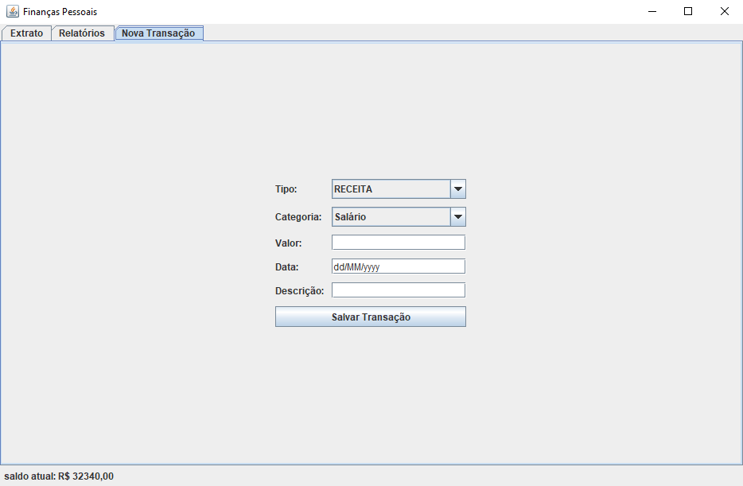
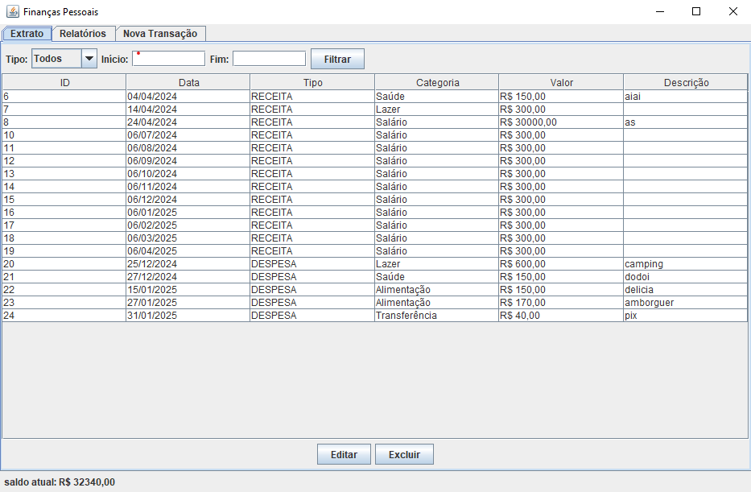
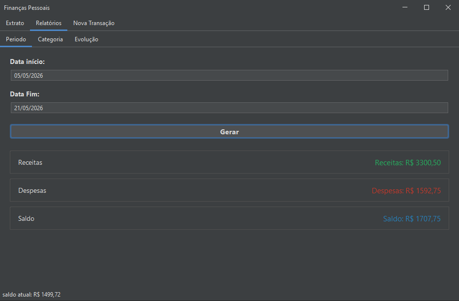
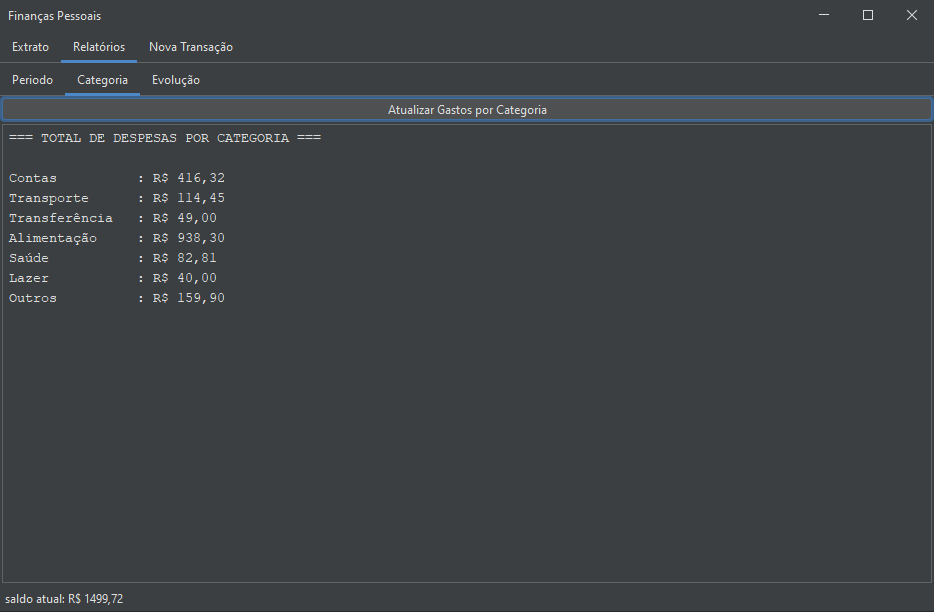
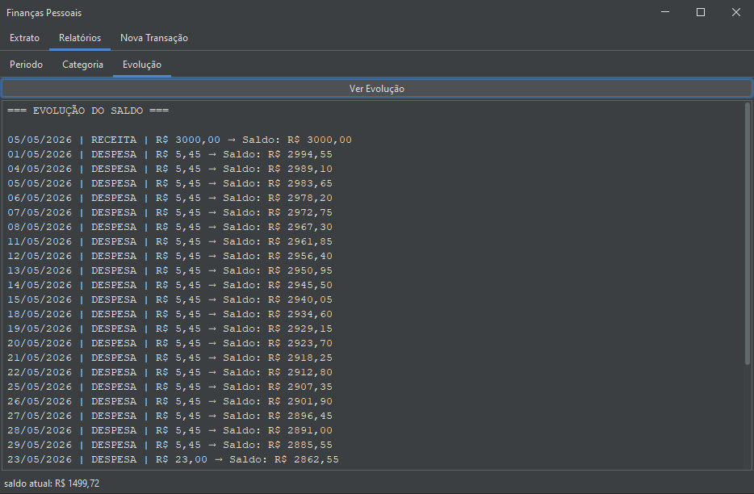

# Sistema de Gerenciamento de Finanças Pessoais

Sistema desenvolvido em Java com interface gráfica (Java Swing) para controle de receitas e despesas pessoais. Permite registrar movimentações financeiras, consultar o histórico, aplicar filtros e gerar relatórios.

Projeto desenvolvido como trabalho final da disciplina **Linguagem de Programação 1**.

---

## Tecnologias utilizadas

| Tecnologia | Uso |
|---|---|
| Java 17+ | Linguagem principal |
| Java Swing | Interface gráfica |
| Java IO (BufferedReader/Writer) | Persistência em arquivo |
| Java Time (LocalDate) | Validação e comparação de datas |
| Arquivo CSV | Armazenamento dos dados |

---
## Dependências
| Biblioteca | Versão | Uso |
|---|--------|---|
| [FlatLaf](https://github.com/JFormDesigner/FlatLaf) | 3.7.1  | Tema visual moderno para Swing |

## Como executar

### Pré-requisitos
- Java 17 ou superior
- Arquivo `flatlaf-3.7.1.jar` na pasta `lib/` (incluso no repositório)

### Compilar
```bash
javac -cp lib/flatlaf-3.7.1.jar *.java
```

### Executar
```bash
java -cp ".;lib/flatlaf-3.7.1.jar" Main        # Windows
java -cp ".:lib/flatlaf-3.7.1.jar" Main        # Mac/Linux
```

> O sistema cria automaticamente a pasta `dados/` com o arquivo `transacoes.csv` na primeira transação salva. Não é necessário criar nada manualmente.

---

## Funcionalidades

- **Cadastro de transações** — registre receitas e despesas com tipo, categoria, valor, data e descrição
- **Categorias dinâmicas** — as categorias disponíveis mudam automaticamente conforme o tipo selecionado (receita ou despesa)
- **Extrato completo** — visualize todas as transações em tabela ordenada
- **Filtros** — filtre por tipo (receita/despesa) e por período de datas
- **Edição** — edite qualquer campo de uma transação existente
- **Exclusão** — exclua transações com confirmação de segurança
- **Saldo em tempo real** — exibido na barra inferior, atualizado automaticamente
- **Relatório por período** — totais de receitas, despesas e saldo em um intervalo de datas
- **Relatório por categoria** — total gasto em cada categoria de despesa
- **Evolução do saldo** — saldo acumulado transação a transação
- **Persistência** — dados salvos em arquivo CSV e recarregados automaticamente ao abrir

---

## Estrutura do projeto

```
Leao/
│
├──src
│    ├── Main.java                   → Ponto de entrada — inicializa e abre a janela
│    ├── Transacao.java              → Modelo de dados de uma movimentação financeira
│    ├── GerenciadorTransacoes.java  → Lógica de negócio (adicionar, filtrar, calcular)
│    ├── Validador.java              → Validações de entrada (valor, data, campos)
│    ├── PersistenciaCSV.java        → Leitura e gravação do arquivo CSV
│    ├── JanelaPrincipal.java        → Janela raiz com abas e barra de saldo
│    ├── PainelFormulario.java       → Aba de cadastro de novas transações
│    ├── PainelExtrato.java          → Aba de extrato com filtros e ações
│    └──  PainelRelatorios.java      → Aba de relatórios financeiros
│
├── lib/
│   └── flatlaf-3.7.1.jar       → biblioteca de tema visual
└── dados/
    └── transacoes.csv          → Arquivo gerado automaticamente pelo sistema
```

---

## Arquitetura

O projeto segue uma separação em camadas:

```
[ Interface (Swing) ]
        ↓ chama
[ GerenciadorTransacoes ]   ← lógica de negócio
        ↓ usa
[ Transacao ]               ← modelo de dados
        ↓
[ PersistenciaCSV ]         ← leitura e gravação em arquivo
```

Essa separação garante que a lógica de negócio não depende da interface gráfica — se fosse necessário trocar o Swing por uma interface web, o `GerenciadorTransacoes` não precisaria ser alterado.

---

## Formato do arquivo CSV

Cada linha do arquivo `dados/transacoes.csv` representa uma transação no formato:

```
id;tipo;categoria;data;descricao;valor
```

**Exemplo:**
```
1;RECEITA;Salário;05/05/2025;Salário maio;3500.0
2;DESPESA;Alimentação;07/05/2025;Mercado;320.5
3;DESPESA;Transporte;10/05/2025;Gasolina;150.0
```

> O ponto e vírgula (`;`) é o separador de campos. Caso a descrição contenha `;`, ele é substituído por `,` automaticamente ao salvar.

---

## Telas do sistema

### Cadastro de nova transação
Acesse a aba **"Nova Transação"** para registrar uma movimentação.



> Preencha o tipo, selecione a categoria (muda automaticamente conforme o tipo), informe o valor, a data no formato `dd/MM/yyyy` e uma descrição opcional. Clique em **Salvar Transação**.

---

### Extrato e filtros
Acesse a aba **"Extrato"** para visualizar e gerenciar todas as transações.



> Use os filtros no topo para buscar por tipo ou período. Clique em uma linha da tabela para selecioná-la e use os botões **Editar** ou **Excluir** na parte inferior.

---

### Relatório por período
Acesse **"Relatórios" → aba "Período"** para ver os totais em um intervalo de datas.



> Informe a data de início e fim no formato `dd/MM/yyyy` e clique em **Gerar**. O sistema exibe o total de receitas, despesas e o saldo do período.

---

### Relatório por categoria
Acesse **"Relatórios" → aba "Categoria"** para ver os gastos por categoria.



> Clique em **Atualizar Gastos por Categoria**. O sistema lista todas as categorias de despesa com o total gasto em cada uma.

---

### Evolução do saldo
Acesse **"Relatórios" → aba "Evolução"** para acompanhar o saldo ao longo do tempo.



> Clique em **Ver Evolução**. O sistema exibe cada transação com o saldo acumulado após ela, permitindo identificar em qual momento o saldo sofreu variações significativas.

---

## Validações implementadas

| Campo | Regra |
|---|---|
| Valor | Deve ser numérico e maior que zero |
| Data | Deve estar no formato `dd/MM/yyyy` e ser uma data válida |
| Campos obrigatórios | Tipo, categoria, valor e data não podem ser vazios ou apenas espaços |
| Exclusão | Exige confirmação do usuário antes de remover |
| Edição | Valida data e valor antes de confirmar a alteração |

---

## Melhorias futuras

- [ ] Banco de dados (SQLite) para substituir o arquivo CSV
- [ ] Sistema de login com múltiplas contas de usuário
- [ ] Gráficos visuais de pizza e linha com Java2D ou biblioteca externa
- [ ] Exportação de relatórios em PDF
- [ ] Definição de metas de economia com alertas de limite
- [ ] Interface responsiva com tema claro/escuro
- [ ] Importação de extratos bancários em CSV

---

## Autor

Celso Fernandes.
Gabriel Figueiredo.
Desenvolvido como projeto final de **Linguagem de Programação 1**.

